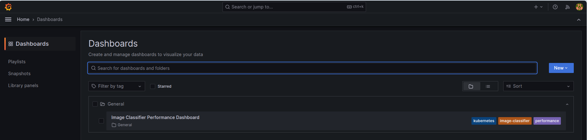
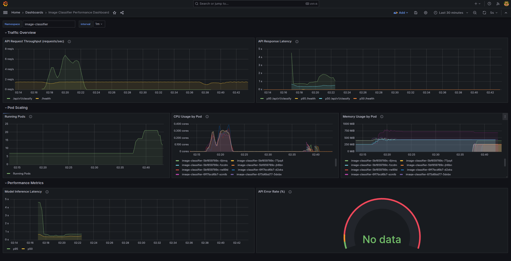

# **Distributed Image Classifier on Kubernetes** 
This is a scalable machine learning application designed to classify uploaded images via a FastAPI.

The project uses the following key services:

- **Image Classifier**: Python web application (FastAPI) that accepts image uploads and returns classification results.
- **Prometheus**: Collects and stores application metrics.
- **Grafana**: Visualize metrics collected from the application via Prometheus, helping to monitor load and scaling under testing.
- **Horizontal Pod Autoscaler (HPA)**: Automatically scales the API pods based on CPU and memory usage.
- **Minikube**: Provides a local Kubernetes cluster.

All services are deployed inside the Kubernetes cluster using YAML.

&nbsp;
&nbsp;
&nbsp;

## Local Development Setup

### 1. Install Minikube

On Linux:
```sh
curl -LO https://github.com/kubernetes/minikube/releases/latest/download/minikube-linux-amd64
sudo install minikube-linux-amd64 /usr/local/bin/minikube && rm minikube-linux-amd64
```
On Mac:
```sh
brew install minikube
```
On Windows:
 1. Download and run the installer for the [latest release](https://storage.googleapis.com/minikube/releases/latest/minikube-installer.exe). 
2. Add the minikube.exe binary to your PATH. _(Make sure to run PowerShell as Administrator)_
```sh
$oldPath = [Environment]::GetEnvironmentVariable('Path', [EnvironmentVariableTarget]::Machine)
if ($oldPath.Split(';') -inotcontains 'C:\minikube'){
  [Environment]::SetEnvironmentVariable('Path', $('{0};C:\minikube' -f $oldPath), [EnvironmentVariableTarget]::Machine)
}
```

For other architectures use [minikube documentation](https://minikube.sigs.k8s.io/docs/start/?arch=%2Flinux%2Fx86-64%2Fstable%2Fbinary+download) 

### 2. Start a Minikube cluster:
```sh 
minikube start --cpus=4 --memory=4g --addons=metrics-server
```
### 3. Run the deployment script 
```sh 
./scripts/deploy.sh 
```

After successful deployment, three services will be available. You can access them using the following commands:

API:      
  ```sh 
  minikube service image-classifier -n image-classifier --url
  ```

Prometheus: 
  ```sh 
  minikube service prometheus -n image-classifier --url
  ```

Grafana:    
  ```sh 
  minikube service grafana -n image-classifier --url
  ```

&nbsp;
&nbsp;


## Load Testing

To simulate high load on the API using the provided script, follow these steps:

1. First, retrieve the API URL and port by running:

    ```sh 
    minikube service image-classifier -n image-classifier --url
    ```

2. Copy the port from the _first line_ of output. It looks something like:

    ```sh 
    http://192.168.49.2:30717
    http://192.168.49.2:30906
    ```

    Here, `192.168.49.2` is host and `30717` is the port to use.

3. Then, run the load testing script by specifying the port:

    ```bash
    ./scripts/load.sh -h <HOST> -p <PORT>
    ```

    **Example:**

    ```bash
    ./scripts/load.sh -h 192.168.49.2 -p 30717
    ```

The script will send multiple POST requests to the `/predict` endpoint, simulating concurrent users and allowing to observe system behavior and scaling in Grafana dashboards.

>  **Note:** The `./load-testing` folder includes a default test image named `images.jpeg`.  
> You may replace the image content, but **do not change the filename**, as it is required for automated tests.

&nbsp;
&nbsp;

## Monitoring with Grafana

After deploying the services, Grafana will be available inside the cluster.

1. First, retrieve the Grafana URL and port by running:

   ```sh 
   minikube service grafana -n image-classifier --url
   ```
This command will provide a URL, for example:
    ```
    http://192.168.49.2:30261
    ```
    
Open this link in your browser.

2. Use default login

        Username: admin

        Password: admin


- The dashboard "Image Classifier Dashboard" is loaded automatically.

Once logged in:

3.  Open the side menu.

4.  Navigate to Dashboards.

5. You should find dashboard named "Image Classifier Dashboard" in General folder.
    


- It shows request rates, latency, pod scaling, CPU/memory usage, and error rates.


 


&nbsp;
&nbsp;

## Cleaning Up Resources

When you are done with testing or developing, you can clean up all deployed resources.

Run cleanup script:
 ```sh 
 ./scripts/cleanup.sh
 ```

This script will:

   * Delete the Kubernetes deployments, services, and monitoring tools.

   * Free up resources used by Minikube.

Stop and delete the Minikube cluster:
```sh
minikube delete
```
