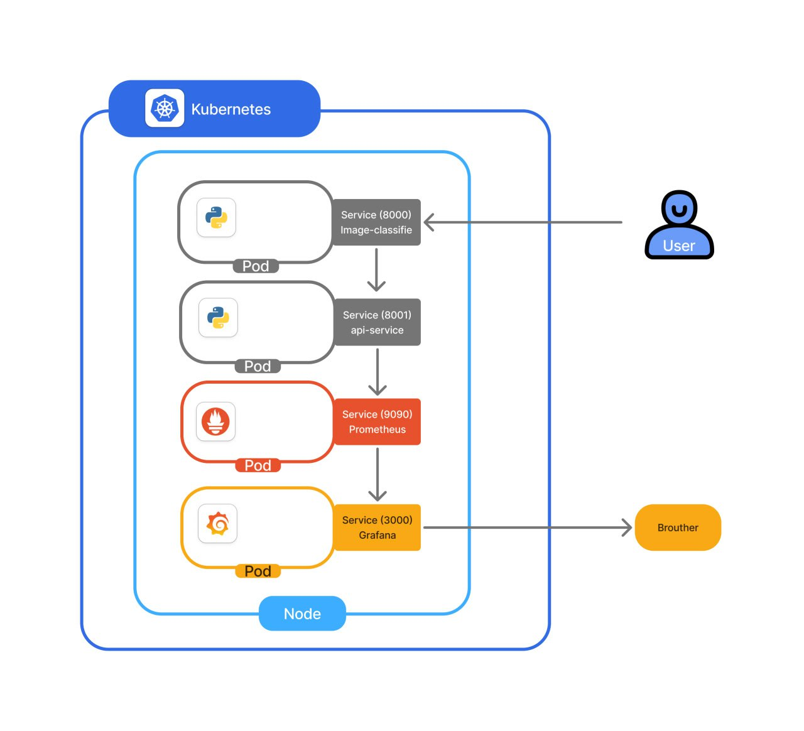
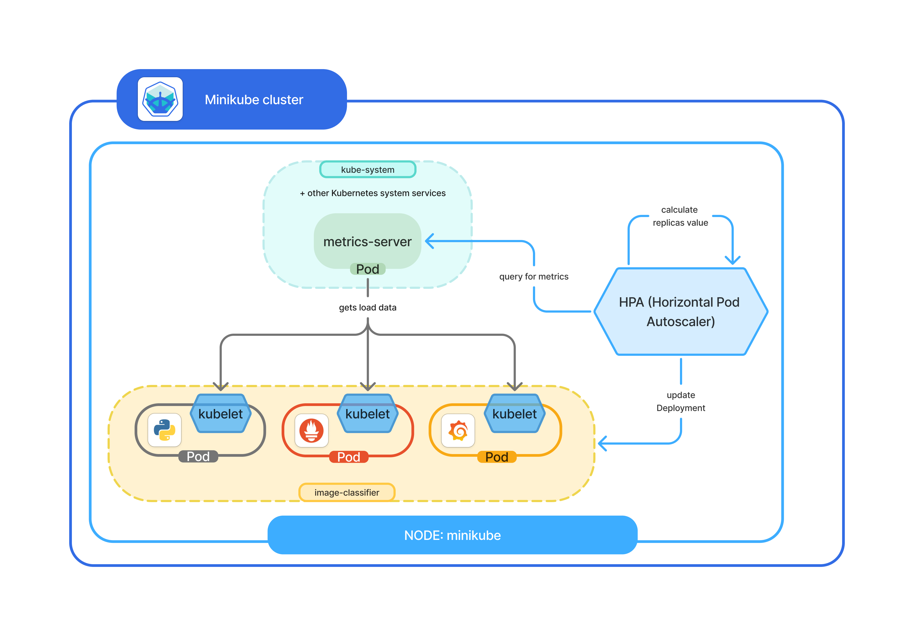

# Architecture Overview

This document outlines the architecture of a distributed image classifier deployed on a Kubernetes cluster. It covers development, deployment, scaling, monitoring, and testing workflows.

---

## Project Structure

```
.
├── Dockerfile
├── README.md
├── app
│   ├── api
│   ├── classifier
│   ├── config.py
│   ├── main.py
│   └── requirements.txt
├── docker-compose.yml
├── docs
│   ├── architecture.md
│   └── assets
│       └── architecture_diagram.png
├── kubernetes
│   ├── configmap.yaml
│   ├── deployment.yaml
│   ├── hpa.yaml
│   └── service.yaml
├── load-testing
│   └── images.jpeg
├── monitoring     # Prometheus & Grafana configs
│   ├── grafana
│   └── prometheus
└── scripts        # Bash scripts for deployment &testing
    ├── cleanup.sh
    ├── deploy.sh
    ├── load.sh
    └── status.sh
```

---

## System Architecture Overview

  

This system runs in a **Minikube-based Kubernetes cluster** and includes the following core components:

- **FastAPI-based Image Classifier**  
  Serves a REST API for uploading images and returning predicted labels using a pretrained MobileNetV2 model.

- **Prometheus**  
  Automatically scrapes application and system metrics (e.g., request counts, latency, CPU usage) every 5 seconds.

- **Grafana**  
  Provides dashboards to visualize key metrics like API throughput, inference latency, and resource usage.

- **Horizontal Pod Autoscaler (HPA)**  
  Dynamically adjusts the number of application pods (from 2 to 10) based on CPU and memory usage thresholds (80%).

- **Kubernetes Services & LoadBalancer**  
  Exposes the API and metrics endpoints externally and routes requests to the appropriate pods.

- **Monitoring Integration**  
  Prometheus discovers the app via annotations and scrapes `/metrics`; Grafana is pre-configured with dashboards using Prometheus as the data source.


See the **Request Flow** section below for a step-by-step walkthrough of how a client request is processed.

--- 
## Deployment Environment

The system is deployed on a local **Minikube** Kubernetes cluster, which provides a lightweight, single-node environment ideal for development and testing.

- **Kubernetes Distribution**: Minikube (v1.32+ recommended)  
- **Cluster Setup**:
  - 2 vCPUs and 4 GB memory allocated (adjustable via Minikube flags)  
  - Ingress and metrics-server addons enabled
- **Deployment Tools**:
  - `kubectl` for managing Kubernetes resources  
  - `docker-compose` for local service orchestration  
  - Bash scripts (`deploy.sh`, `cleanup.sh`, `status.sh`) to automate setup and teardown
- **Namespaces**: All Kubernetes resources (e.g., Prometheus, Grafana, app) are deployed in the `image-classifier` namespace for isolation.

---

### Key Components

1. **Application (FastAPI + Classifier)** 
 Handles HTTP requests and classifies uploaded images using a neural network. 
   - A FastAPI web server handles image upload and classification.  
   - Uses a pretrained **MobileNetV2** model to predict image labels.  
   - Main components:
     - `main.py`: App entry point  
     - `routes.py`: Defines `/classify`, `/health`, `/metrics` endpoints  
     - `model.py` and `utils.py`: Load the model and process images  

2. **Configuration**  
   - Managed via `config.py` using environment variables or defaults.  
   - Includes settings like model path, label file path, and metric toggles.  
   - Kubernetes can override settings via a ConfigMap.

3. **Local Development (Docker Compose)**  
   - `docker-compose.yml` runs:
     - The app on ports **8000** (API) and **8001** (metrics)  
     - Prometheus on **9090** for metrics viewing

4. **Kubernetes Deployment**  
   - Deploys multiple app replicas behind a LoadBalancer  
   - Enables automatic scaling (2–10 pods) when CPU/memory > 80%  
   - Health checks and Prometheus annotations are built-in  
   - LoadBalancer routes:
     - Port **80** → app API (8000)  
     - Port **8001** → app metrics  

5. **Monitoring: Prometheus + Grafana**  
   - **Prometheus** collects metrics from the app and Kubernetes  
     - Configured to scrape `/metrics` every 5 seconds  
     - Access via web UI on port **9090**  
   - **Grafana** visualizes metrics like:
     - API usage, latency, error rates  
     - Pod scaling, CPU and memory use  
     - Model inference times  
     - Available at port **3000** with preloaded dashboards

6. **Load Testing & Scripts**  
   - `load.sh` sends test image(s) to `/classify` using `curl`  
   - Other helper scripts:
     - `deploy.sh`: Launch app on Kubernetes  
     - `status.sh`: Check cluster status  
     - `cleanup.sh`: Remove deployments

---
### Request Flow (Diagram Walkthrough)

1. A client sends an image to the `/classify` endpoint via HTTP POST.
2. The Kubernetes **LoadBalancer** forwards the request to a FastAPI pod.
3. The application:
   - Validates and preprocesses the image.
   - Runs inference using MobileNetV2.
   - Returns predicted labels to the client.
4. Application metrics (e.g., requests, latency) are recorded and made available at the `/metrics` endpoint.
5. **Prometheus** scrapes this endpoint every 5 seconds.
6. **Grafana** visualizes the collected metrics through preconfigured dashboards.
7. If load increases, the **HPA** increases the number of pods automatically to maintain performance.

## Scaling Behavior

- **Min replicas**: 2  
- **Max replicas**: 10  
- **Scale triggers**:  
  - CPU > 80%  
  - Memory > 80%  


---

## Monitoring & Metrics

### Metrics
- `api_requests_total`: Total number of requests received by the API  
- `api_request_latency_seconds_bucket`: Histogram tracking request durations  
- `model_inference_latency_seconds_bucket`: Histogram tracking model prediction times   

## Future Enhancements

1. **TensorFlow Serving** – for scalable, production-ready inference  
2. **Redis Caching** – to reduce repeated inference costs  
3. **OpenTelemetry tracing** – for full-stack observability  
4. **Latency-based autoscaling** – better scaling decisions than CPU/mem  
5. **Canary deployments (Istio/Argo)** – safer progressive rollouts
